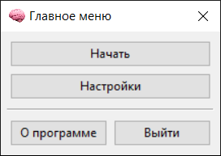
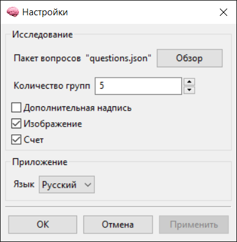
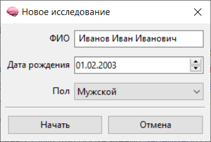
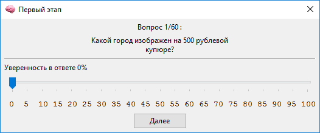
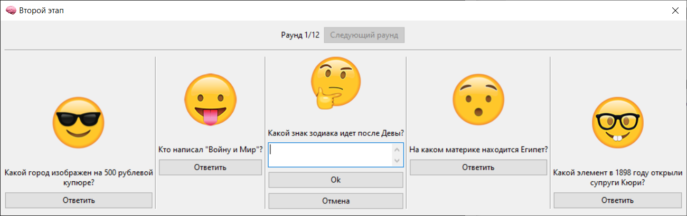

# Приложение для проведения исследования

## Описание
Приложение предназначено для проведения исследования. Исследование направлено на изучение влияния величины когнитивной нагрузки на выбор, совершаемый человеком.

## Системные Требования
### Язык
Разработка ведется полностью на [Python](https://www.python.org/downloads) версии 3.7.
### Сторонние инструменты
Для создания графического интерфейса выбрана кроссплатформенная библиотека [wxWidgets](https://www.wxwidgets.org/), а конкретно ее обертка для Python — [wxPython](https://wxpython.org/).

## Сборка и Запуск
Актуальная версия приложения поддерживает следующие опции:
* _Пользовательские пакеты вопросов_ — Документация по их созданию и редактированию находится в разделе [wiki]() "Пользовательские пакеты вопросов".
* _Изображения_ — Если требуется работа этой опции, необходимо поместить в директорию с главным скриптом изображения в формате .png, названные числами от 1 до N, где N — количество групп вопросов.

Полный список опций указан в разделе [wiki]() "Настройки". Здесь же указаны те, без которых запуск исследования может привести к ошибке. Помимо вышеописанных файлов, для запуска могут потребоваться, также, следующие (__жирным__ выделены обязательные пункты, без которых приложение не запустится):
* __icon.png__ — файл иконки приложения
* settings.json — файл настроек приложения, генерируется автоматически по окончании работы программы согласно последним заданным настройкам.

## Интерфейс
### Главное меню

### Настройки

### Новое исследование

### 1-ый этап эксперимента

### 2-ой этап эксперимента

